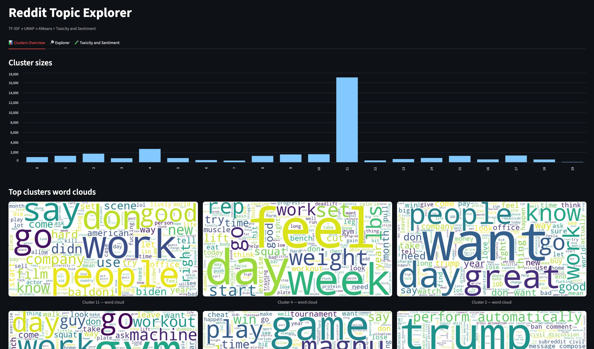
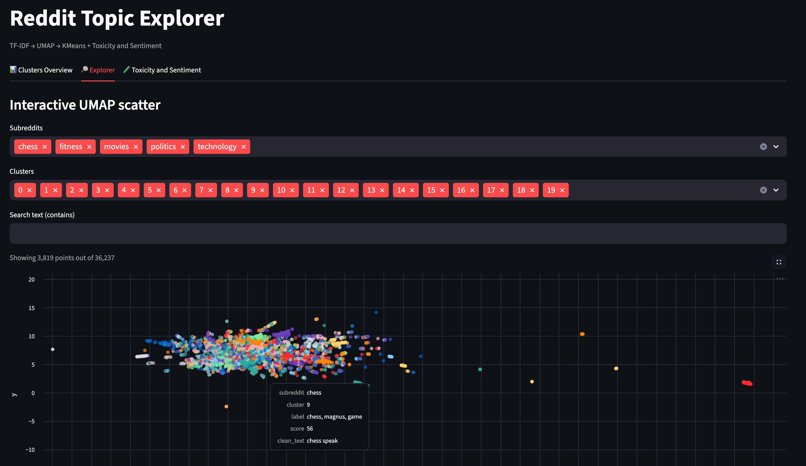
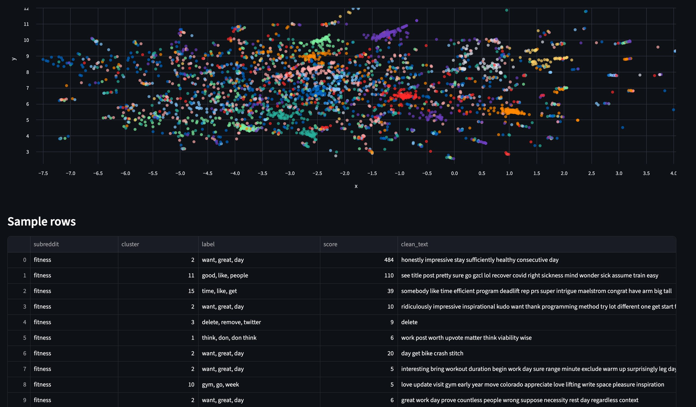
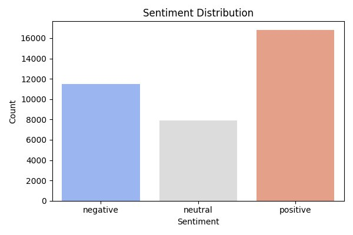
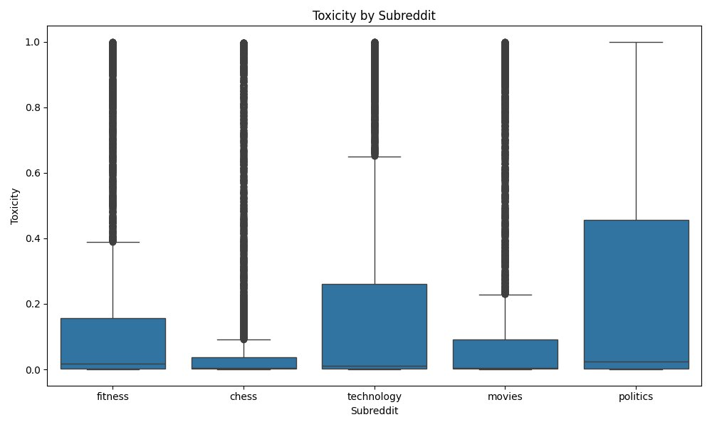

# Reddit Topic Explorer 🧭  
*Interactive NLP platform for exploring topics, clusters, and sentiment in Reddit communities*


<p align="center">
  
  
  
  
  
</p>


---

## 🚀 Idea  

Reddit hosts one of the largest collections of human discussions online. Communities form around shared interests, and conversations inside them capture trends, conflicts, and sentiments.  

This project builds an **interactive platform** to:  
- Automatically **get discussions from multiple subreddits**.  
- **Clean and preprocess text** into machine-learning–friendly features.  
- Apply **TF-IDF + UMAP + KMeans clustering** to uncover **hidden thematic structures**.  
- Enrich clusters with **toxicity detection** (using [Detoxify](https://github.com/unitaryai/detoxify)) and **sentiment analysis**.  
- Provide a **Streamlit-powered interactive app** where users can explore topics visually, filter by subreddit, cluster, or sentiment, and inspect actual comments.  

The result: a **powerful dashboard** that turns raw Reddit comments into structured insights.

---

## 🛠️ Solution  

The pipeline consists of several modular stages:  

1. **Data Ingestion**  
   - Gets Reddit posts & comments using [PRAW](https://praw.readthedocs.io/).  
   - Configurable: choose subreddits, time window, and number of posts/comments.  
   - Data stored in `data/raw/comments.csv.gz`.  

2. **Text Cleaning**  
   - Lowercasing, stopword removal, lemmatization, punctuation stripping.  
   - Result stored in `data/processed/comments_clean.csv.gz`.  

3. **Feature Engineering**  
   - **TF-IDF vectorization**: represent comments as sparse word-weight vectors.  
   - **UMAP** for dimensionality reduction (visual embedding).  
   - Optionally, **Truncated SVD** for dense representation.  

4. **Clustering**  
   - **KMeans** groups semantically similar comments.  
   - Automatic silhouette scoring to pick `k`.  
   - Cluster assignments saved to `artifacts/clusters/labels.csv.gz`.  

5. **Reporting**  
   - **Word clouds** for top clusters.  
   - Cluster distribution plots.  
   - Markdown report with top terms per cluster.  

6. **Toxicity & Sentiment**  
   - Scores every comment for toxicity (`detoxify`).  
   - Classifies sentiment into *positive / neutral / negative*.  
   - Aggregates results across clusters and subreddits.  

7. **Interactive App (Streamlit)**  
   - **Cluster Overview**: sizes, word clouds.  
   - **Explorer**: UMAP scatter plot, filters by subreddit/cluster/score, comment search.  
   - **Toxicity & Sentiment**: dashboards with distributions, KPIs, and sample rows.  

---

## 🌟 Result  

- **36k+ comments** processed across multiple subreddits (`fitness`, `chess`, `technology`, `movies`, `politics`).  
- **20 clusters** discovered, each representing a semantic theme (e.g., training advice, political debates, movie reviews).  
- Clear visualization of **toxic vs non-toxic clusters**, showing how toxicity varies across communities.  
- Fully interactive **visual exploration** — a mix between a data-science report and a real analytical tool.  

---

## 💡 Why it’s useful  

- **Recruitment / HR angle**: shows skills across **NLP, ML, clustering, visualization, and full pipeline design**.  
- **Business angle**: similar approach could power **brand monitoring**, **trend analysis**, **community management tools**, or **toxic content moderation systems**.  
- **Research angle**: explore **emergent themes** and **sentiment shifts** across thousands of discussions.  

---

## 🔧 How to Use  

1. Clone the repo  
```bash
git clone https://github.com/<your-username>/reddit-topics-nlp.git
cd reddit-topics-nlp
```

2. Install dependencies
```bash
python -m venv .venv
source .venv/bin/activate   # or .venv\Scripts\activate on Windows
pip install -r requirements.txt
```

3. Configure Reddit API
Create a .env file in the project root:
REDDIT_CLIENT_ID=your_id
REDDIT_CLIENT_SECRET=your_secret
REDDIT_USER_AGENT=reddit-nlp-demo
SUBREDDITS=fitness,chess,technology,movies,politics
POSTS_PER_SUB=200
MAX_COMMENTS_PER_POST=50
TIME_FILTER=year

4. Run pipeline
```bash
python -m src.ingest.reddit_dump
python -m src.pipeline.clean_text
python -m src.pipeline.features
python -m src.pipeline.cluster
python -m src.pipeline.report
python -m src.pipeline.labeling
python -m src.pipeline.toxicity
python -m src.pipeline.plots
```

5. Launch the app
```bash
streamlit run app/streamlit_app.py
```
Then open http://localhost:8501


🛠️ Tech Stack
Python 3.12
NLP: scikit-learn (TF-IDF, KMeans), UMAP, Detoxify
Visualization: Altair, Seaborn, Matplotlib, WordCloud, Streamlit
Data Handling: pandas, numpy, joblib
Deployment-ready: modular pipelines, cached artifacts


🔮 Future Improvements
Add topic labeling with LLMs (automatic cluster summaries).
Enable real-time Reddit streaming instead of static dump.
Deploy app on Streamlit Cloud or Docker for easier sharing.
Support multi-lingual comments and cross-language clustering.


🤝 Contributing
Contributions are welcome! Feel free to fork, open issues, or submit pull requests.


📜 License
MIT License — free to use and adapt.


